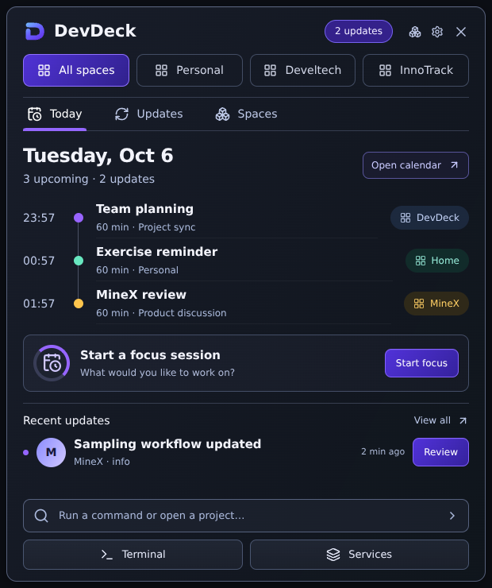
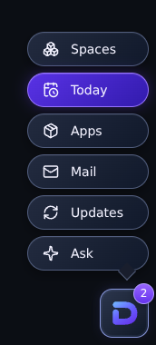
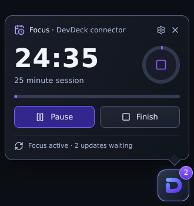

# Deck design correction — 6 October 2026

Reference: the user's saved “DevDeck floating widget: three UI states.png” design from 29 September. The previous implementation used a letter launcher, generic narrow cards, and opened the old command view on first run.

The revised production components use the split-D mark, floating pill navigation, navy glass surfaces and violet controls. Today has workspace filters, view tabs, timeline dots and chips, focus entry, a recent update and command/service shortcuts. Focus is a separate compact card with a circular indicator, progress bar and pause/finish controls. Actual calendar, focus and update data remain connected; example people, sync status and session counts from the mockup are not presented as live facts.

The first visit now opens Today, tracked separately from the existing command-tour preference. Subsequent visits open the launcher. Panel dimensions are limited to monitor bounds during placement. A pause bug that stored an epoch timestamp as elapsed pause time is corrected.

## Checked

- TypeScript build, lint (existing warnings), production Vite build and whitespace checks pass.
- Real React components rendered in Chromium at their configured Today/menu/Focus dimensions; screenshots inspected and clipping corrected.
- Browser interaction checks: pause holds the countdown, resume advances it, finish returns to Today with the start-focus action. No page errors.
- Browser data and native IPC are fixtures, not a Windows runtime test. Installed Windows dragging, docking, notifications and screen transparency still need a smoke test. PR remains draft.

## Reproduce the visual check

Run `npx vite --config vite.harness.config.ts --host 127.0.0.1`, then open `/harness/deck.html?view=today` (620×740), `?view=menu` (172×380), or `?view=focus` (330×350). The harness renders the production DeckPanel with isolated fixture data. The production build does not include these entries.

