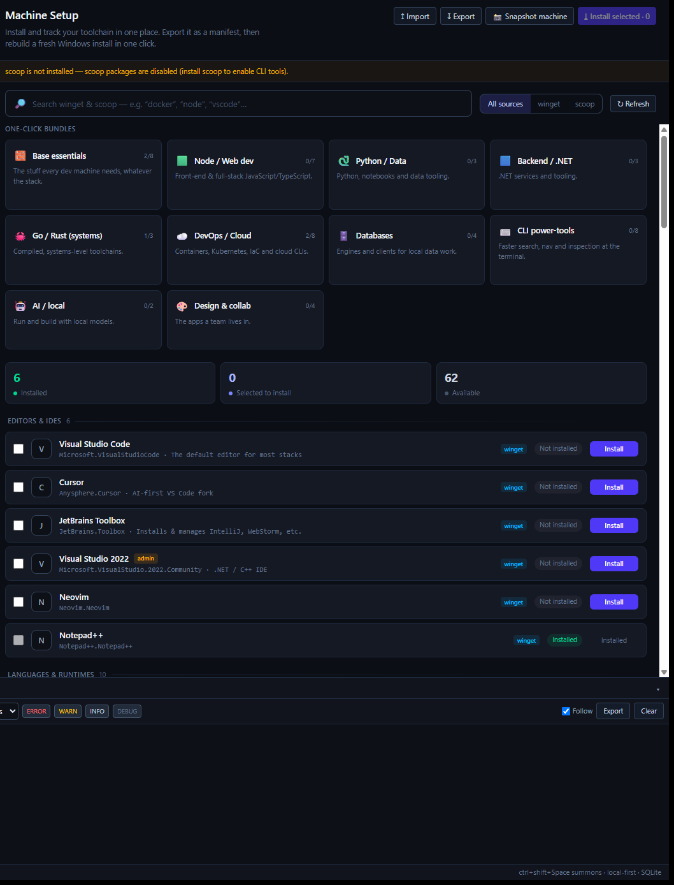
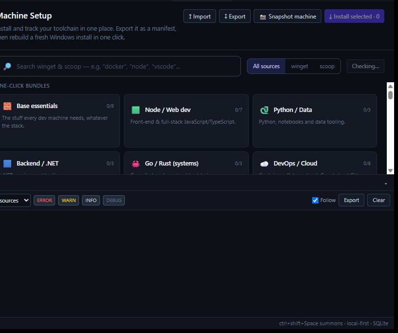

# Machine Setup — Test Report

**Feature:** a new **Machine Setup** section in DevDeck to install and track dev
software via **winget / scoop**, pick one-click **bundles**, and **export/import
a machine manifest** so a fresh Windows install can be rebuilt in a couple of
clicks.

**Status:** implemented end-to-end (Rust backend + React UI), compiles cleanly,
and verified running against real winget data on Windows. Screens below are the
**live app**, not a mockup.

---

## Screens

### Catalog + bundles (live, real winget status)


What this shows, running against the real machine:
- **One-click bundles** with live install counts read from the machine — *Base
  essentials 2/8*, *Go / Rust 1/3*, *DevOps / Cloud 2/8*.
- **Summary tiles** — **6 Installed**, **0 Selected**, **62 Available**.
- **Per-package status detected from winget** — e.g. **Notepad++ → Installed**
  (green), the rest **Not installed** with an **Install** button.
- **Source badges** (winget/scoop) and an **admin** flag on packages that need
  elevation (Visual Studio 2022).
- The **“scoop is not installed”** notice — availability detection working: scoop
  packages are disabled until scoop is present.

### Bundles / header


> The left sidebar and window tabs were cropped out of these shots on purpose —
> this repo is public and they showed real project/service names.

---

## What was built

### Backend — `src-tauri/src/machine.rs`
Five Tauri commands, registered in `src-tauri/src/lib.rs`:

| Command | Purpose |
|---|---|
| `machine_status` | Detects installed packages via `winget export` (structured JSON — far more reliable than parsing `winget list`) and `scoop export`; reports whether each CLI is available. |
| `machine_install` | Installs a batch sequentially in a background thread. Output streams into the shared **log bus**, so it appears in the bottom-bar **Logs** like any other run. Emits `machine:item` (installing/ok/failed) per package and `machine:done` at the end. |
| `machine_snapshot` | Reads what's installed and builds a manifest from it — the “I just reinstalled Windows” snapshot. |
| `machine_export` | Writes a manifest to disk (pretty JSON). |
| `machine_import` | Reads and validates a manifest file. |

Install output reuses `services::push_log`, so nothing new was needed for
log streaming.

### Catalog — `src/lib/machineCatalog.ts`
~65 curated packages (winget-first, scoop for CLIs) typed by category, plus
**10 one-click bundles** (Base essentials, Node/Web, Python/Data, Backend/.NET,
Go/Rust, DevOps/Cloud, Databases, CLI power-tools, AI/local, Design & collab).
Bundles carry optional **post-install steps** (`npm i -g pnpm turbo` after Node,
etc.) with `after` dependencies. Admin-needing packages are flagged `elevate`.

### UI — `src/components/MachineSetup.tsx`
- Searchable catalog grouped by category, with live status badges.
- Bundles add their not-yet-installed packages to the selection.
- **Install selected** / per-row **Install**, streaming to the Logs bar.
- **Import / Export / Snapshot machine** via native file dialogs.
- Availability warnings when winget/scoop aren't present.
- Wired into the dock (`machine` panel), the top-bar **🖥 Machine** button, and
  the **Panels** menu.

### Manifest format (`devdeck.machine.json`)
```jsonc
{
  "name": "my dev machine",
  "version": 1,
  "packages": [
    { "id": "Microsoft.VisualStudioCode", "source": "winget" },
    { "id": "Docker.DockerDesktop", "source": "winget", "elevate": true },
    { "id": "ripgrep", "source": "scoop" }
  ],
  "steps": [ { "run": "npm i -g pnpm turbo", "after": "OpenJS.NodeJS.LTS" } ],
  "repos": []
}
```

---

## Verification

| Check | Result |
|---|---|
| `cargo check` (Rust backend) | ✅ compiles |
| `tsc -b` (TypeScript) | ✅ no errors |
| `oxlint` | ✅ clean (only pre-existing fast-refresh notes) |
| Live run — status detection | ✅ real winget packages detected & matched to catalog |
| Live run — availability | ✅ scoop-absent correctly disables scoop packages |
| Live run — bundles/summary | ✅ counts populated from the machine |

**Not yet exercised end-to-end:** an actual `machine_install` run (it installs
real software, so it wasn't triggered during testing) and manifest
export/import round-trip on disk. Both are wired and compile; they need a live
click-through to confirm.

## Known gaps / next steps
- **Elevation batching** — admin packages are flagged but currently rely on
  winget's own UAC prompt per install; batching them into a single elevated run
  is the planned follow-up.
- **Updates** — status is Installed / Not installed only; “update available”
  detection (via `winget upgrade`) comes next.
- **Post-install steps & repos** — modelled in the manifest and catalog, not yet
  run by the installer.
- **Cross-OS** — the manifest `source` field leaves room for apt/dnf/brew, but
  the app is Windows-only today.

---

*Branch: `feat/machine-setup` · not merged to `main`, not part of a release.*
