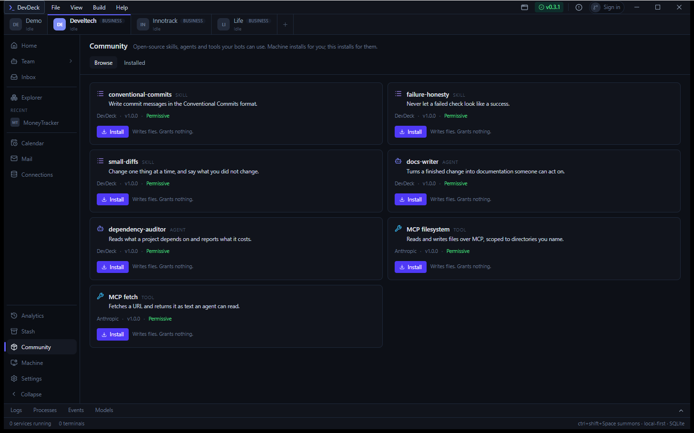
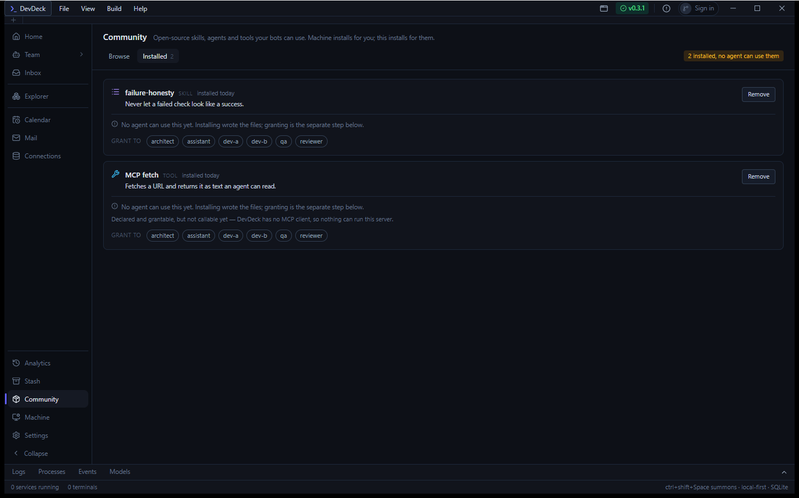
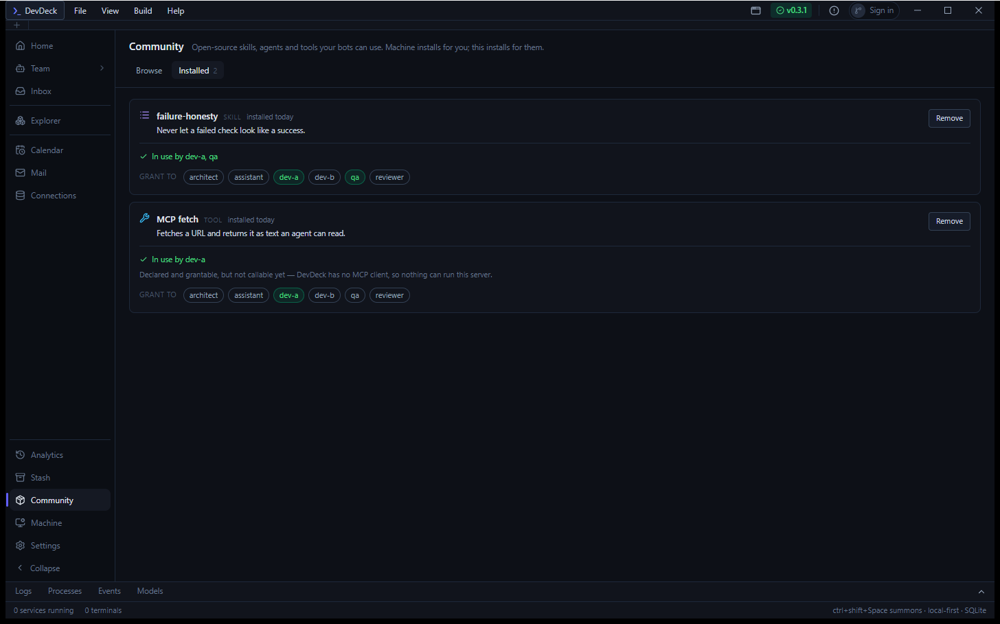
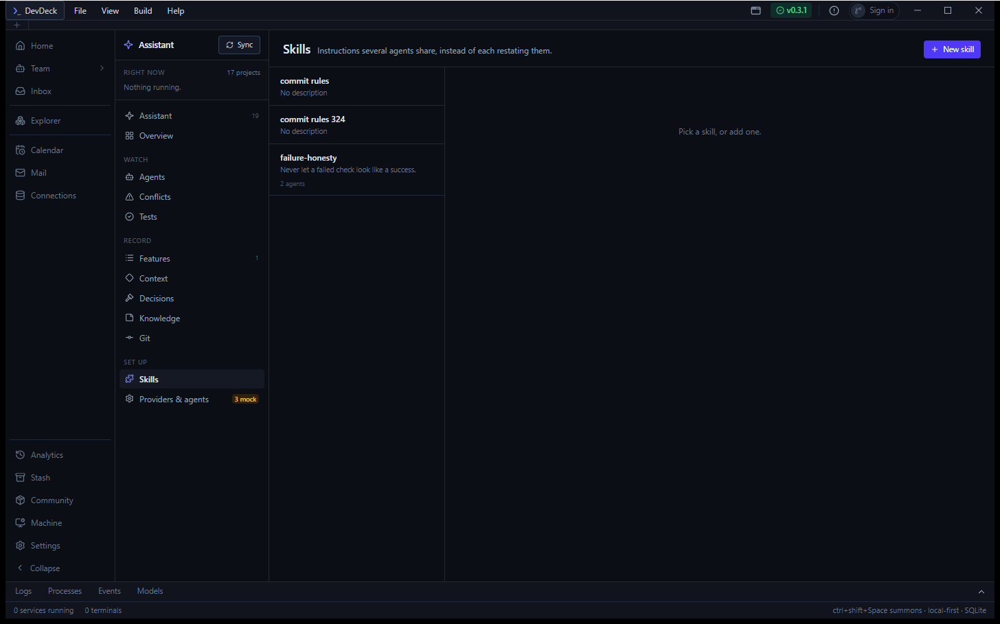
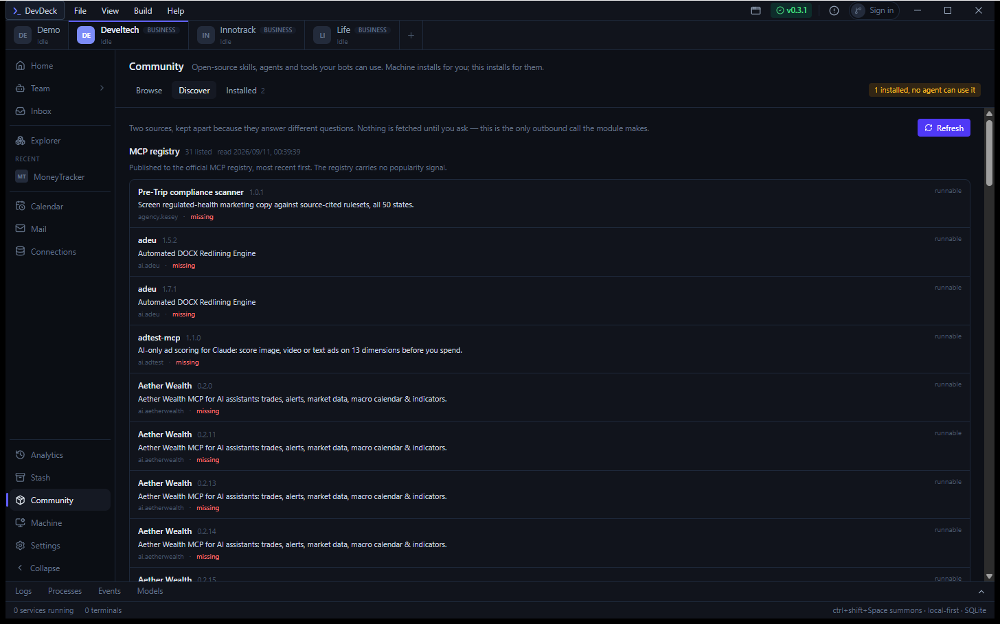
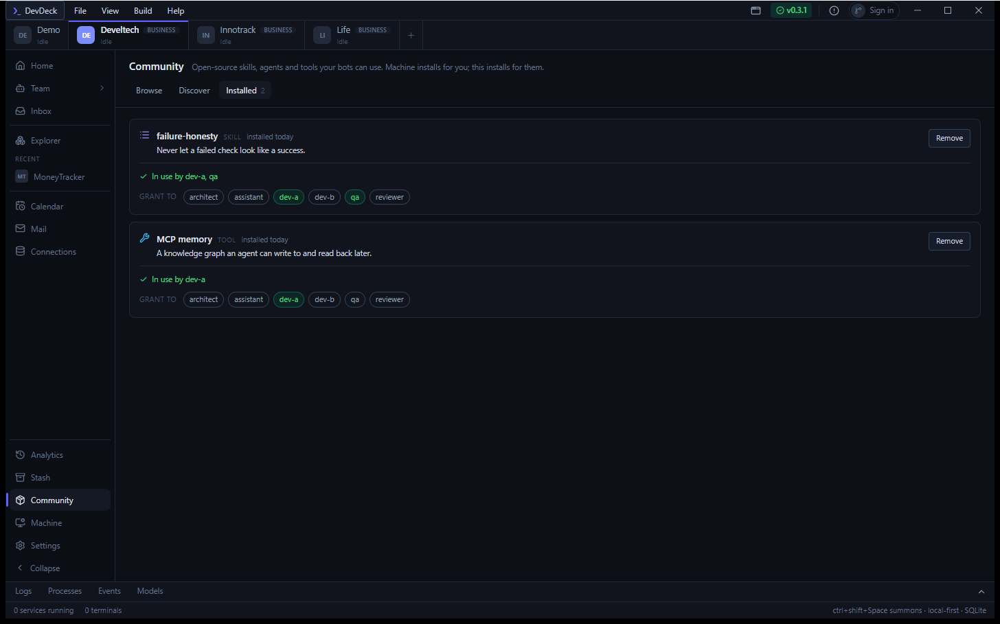

# Community — install for your bots, then decide who may use it

**DevDeck · branch `feat/community` · 11 September 2026**

Open-source skills, agents and tools installed from inside the app, landing
where bots and agents actually read them — and, since the MCP client landed,
actually running. Built against `design/community/` and the roadmap entry that
goes with it.

| | |
|---|---|
| **Rust suite** | 437 passing, 47 new |
| **Slices shipped** | 4 of 4 |
| **Index sources** | 5 — registry, most-starred, trending week, trending month, year |
| **Bugs found by running it** | 3, all mine |

---

## The claim

> Install open-source agents, skills and tools from the app, have it land on
> the bots and agents to use — and show an MCP tool installed, granted, and
> actually called.

---

## 1 · Browse — and what installing does



The rail entry sits **directly above Machine**, and the adjacency is the idea:
Machine installs tools for you, Community installs them for your bots.

Author, version and licence on every row — licence because this is meant to be
sold, and an AGPL runner inside a bot's kit is a decision somebody has to make
knowingly. Every Install button is followed by the sentence the module is built
around:

> **Writes files. Grants nothing.**

---

## 2 · Installed — the state that matters



> **2 installed, no agent can use them**

Installing and granting are two acts, so there is a state in between — and it
is the state a module like this fails in silently. A row that did both in one
click could never show it.

---

## 3 · Granted — reach, not a tick



`failure-honesty` → **In use by dev-a, qa**. The amber badge is gone because
nothing is unreachable any more.

---

## 4 · It landed where the runtime reads



The Assistant's own **Skills** page — which knows nothing about Community and
existed before it — now lists `failure-honesty · 2 agents`. On disk,
`dev-a.md` gained one line, with provider, model, permissions and body
untouched:

```yaml
skills:
- failure-honesty      # installed from Community, granted separately
```

---

## 5 · Discover — five lists, each saying what its order means



Live, from the official registry. Five sources, deliberately **not merged**: a
list whose order is partly a documented sort and partly somebody's unpublished
algorithm cannot describe itself in a sentence, and each of these can.

| Source | What it knows | What its order means |
|---|---|---|
| **MCP registry** | what a server is, and how to run it | most recently published — it carries no popularity signal |
| **Most starred** | stars | a documented GitHub sort, `topic:mcp` and friends |
| **Trending week / month** | nothing but a name | GitHub's own judgement, by an algorithm never published |
| **Over the year** | growth | DevDeck's own subtraction — *not comparable* with the two above |

The goal said to check for an official MCP registry first. There is one, it is
live, and it is the only source that knows both what a server is and how to run
it. Its `packages` become a command — npm through `npx -y`, pypi through `uvx`
— and a registry type we cannot run yields no command, because an Install
button that fails on click is worse than no button. Only stdio servers are
listed; the registry is full of HTTP ones and this client speaks stdio.

Nothing fetches on page load. Refreshing is a button, because this is the only
outbound call the module makes.

---

## 6 · An MCP server, installed and granted



**MCP memory** — installed today, **In use by dev-a**, the `dev-a` chip lit.

Note what is *not* on this row any more. Before the client existed it read
*"Declared and grantable, but not callable yet — DevDeck has no MCP client, so
nothing can run this server."* That sentence is gone rather than softened,
because it stopped being true — and the test that asserted it was inverted
rather than deleted.

---

## The payoff, asserted rather than described

`an_installed_server_is_refused_until_granted_and_then_really_runs` — a real
Node process over real stdio, no mocks in the transport:

```rust
// 1. Installed, not granted.
let before = p.tools.execute(&w.bus, "dev-a", &scope, &call, None);
assert!(before.denied);
assert!(w.mcp.statuses().is_empty(), "a refusal starts no process");

// 2. The separate, deliberate act.
w.set_permission("dev-a", "mcp.notes", "full").unwrap();

// 3. Called for real.
let after = p.tools.execute(&w.bus, "dev-a", &scope, &call, None);
assert_eq!(after.output.trim(), "remembered: the sync bug is in the retry loop");
assert_eq!(w.mcp.statuses()[0].id, "notes");   // one process, started on demand

// 4. And qa still cannot: a grant is to one agent, not to the installation.
assert!(p.tools.execute(&w.bus, "qa", &scope, &call, None).denied);
```

Writing it surfaced a subtlety now recorded in the test: a tool service holds a
snapshot of the matrix, so granting **rebuilds** the services, and a handle
taken before the grant keeps the old answer.

**What is not proven here.** The model half. "Called by an agent" in the live
app needs a configured provider, and the agents on this machine point at a
provider named `boom` that no longer exists — so a real turn cannot happen.
What is proven is that a permission and a process meet correctly, which is the
part this module owns. The MCP tools *are* offered to the model
(`mcp_definitions_for`, folded into the same list as the built-ins in both the
agent runtime and the assistant), and only when granted and running.

---

## Three bugs, all found by running it

### The app aborted on launch, and every test passed

`reqwest::blocking` builds its own tokio runtime and drops it when the call
returns. Dropping a runtime inside another runtime's async context panics —
*"Cannot drop a runtime in a context where blocking is not allowed"* — and a
Tauri command body is exactly that context. It took the process down and
poisoned the database mutex on the way, so the visible second panic was a
`PoisonError` somewhere unrelated-looking.

Every test was green throughout, because they all exercise the parsers and none
of them exercise a fetcher. The fetchers are the one part only the running app
touches. `off_runtime` hops to a plain OS thread.

### A catalog entry that named a package which does not exist

The starter pack shipped `@modelcontextprotocol/server-fetch`. npm answers
**404**. Nobody would have found out until they clicked Install. I wrote it
from memory without running it — the same class of mistake as a green tick over
a failed check.

The starter pack now carries one MCP server, and it is one that has actually
been spoken to from this client. It does not need to be a catalogue any more:
Discover reads the registry, which is where servers publish themselves.

### Five rows for one server

The registry serves every version ever published, so *Aether Wealth* arrived as
five rows differing only in a version number. `isLatest` and `status` are
exactly the fields for it. A server whose metadata says neither is **kept** —
absent means the registry did not say, not that the answer is no.

---

## The rule the whole module is built on

**A failed fetch is never an empty list.** The cache keeps the last good answer
with the time it was taken; a failure returns that, with `ok: false` and the
reason, and the page shows which of the two facts it has. Trending is the
sharpest case — it is a scrape of markup that will change without notice, so a
page that loads and yields nothing recognisable is an *error*:

```rust
assert!(parse_trending("<html>a redesign happened</html>", "week").is_empty());
// …and fetch_trending turns exactly that into an Err, which refresh renders
// as the last good list plus a reason.
```

---

## Tests worth naming

| Test | Why it exists |
|---|---|
| `an_mcp_call_from_an_agent_with_no_grant_is_refused_before_anything_starts` | Points a grant-less agent at a server whose command could not possibly run — if the refusal weren't real, it would fail with a spawn error instead of a denial |
| `a_reply_is_matched_by_id_not_by_arriving_next` | A server may interleave notifications; a client taking the next line hands a log message back as a tool result |
| `the_handshake_sends_initialize_then_says_it_is_initialized` | A correct server may refuse everything until the notification arrives — skipping it works against lenient servers and hangs against correct ones |
| `a_tool_that_reports_an_error_is_an_error_not_an_answer` | `isError` is the server saying the tool failed; returning its text as a result puts a failure into a transcript as fact |
| `a_tool_granted_at_none_is_not_reach` | `none` is stored exactly as a real grant is — counting it would make every install look wired up |
| `markup_we_cannot_read_is_a_failure_not_an_empty_trending_list` | The scrape will break; the day it does the answer must be "we could not look" |
| `one_reading_is_a_number_not_a_change` | Every repository is new once; a gain of zero would fill the year with rows that have not earned a place |
| `the_year_says_it_is_empty_and_why_rather_than_pretending` | `ok: true`, `fetched_at: 0` — nothing was measured, so no time is claimed |
| `only_the_latest_active_version_of_a_server_is_listed` | The five-rows bug, kept fixed |
| `nothing_is_blocked_now_that_there_is_an_mcp_client` | Inverted rather than deleted: a claim that stopped being true is worth a test saying so |

---

## Still not built

From slice 4's tail, and named rather than quietly skipped:

- **One repo in full** — the single-repository page.
- **Permissions as its own page.** Community servers *are* in the matrix
  already, beside the built-ins; what is missing is the dedicated screen.
- **Models, and the runners that serve them.**
- **Bundles that carry grants.** The design puts bundles on Browse as a strip;
  a Community bundle also carries grants, and the roadmap flags that as
  possibly deserving its own page. It has neither yet.
- **Installing from Discover.** The registry list is read-only for now:
  `community_install` resolves ids against the starter catalogue. Wiring it to
  registry entries is small, and it is the obvious next thing.

---

**Evidence.** `cargo test` — 437 passed, 0 failed. `npx tsc -b` and `cargo
check` clean. Screenshots captured from the running debug build via per-window
`PrintWindow`. Agent files quoted verbatim from the personal store. The MCP
handshake and tool call verified against a real spawned Node process, and
`@modelcontextprotocol/server-memory` verified by running it and reading its
`tools/list` before it was put in the catalogue.
