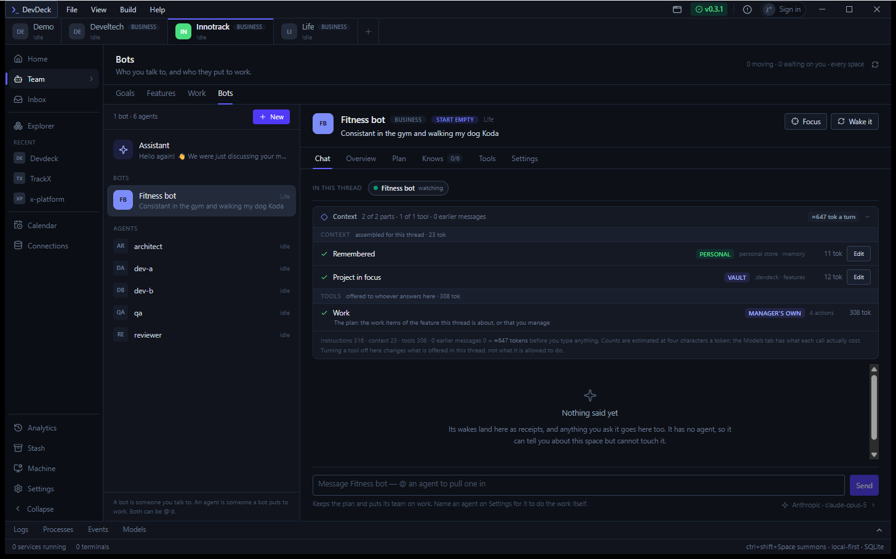
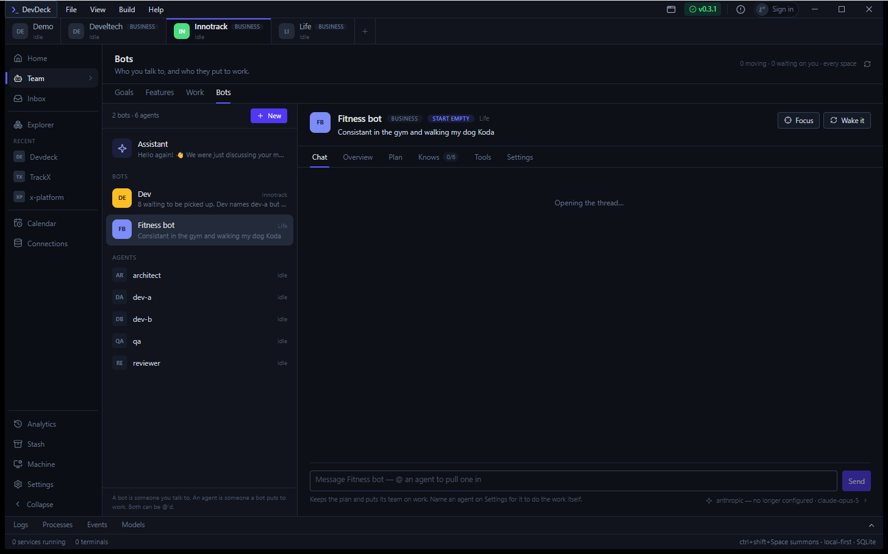
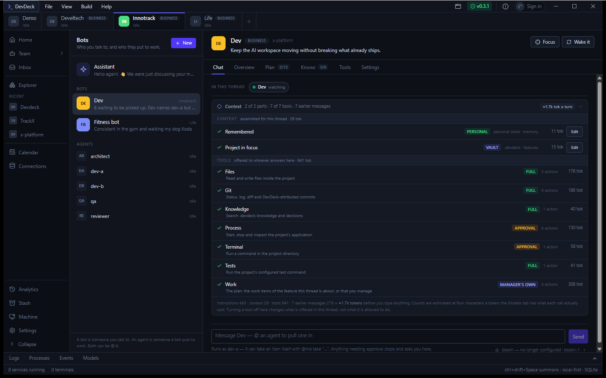

# Bots, agents and the threads between them

**DevDeck · AI Workspace · 6 September 2026 · branch `feat/ai-workspace`**

Two new end-to-end scenarios walk a goal down to its work items and back, through
the manager that owns it and the agents it puts on it. Then the same shape, built
for real in the app — where it stops, and why it stops.

| | |
|---|---|
| **Rust suite** | 381 passing, none skipped |
| **New scenarios** | 2 — first coverage of the goal layer |
| **Comms paths proven** | 4 of 5 |
| **Live in the app** | blocked — no configured provider |

---

## What was already covered, and what was not

The honest starting point: most of the comms paths already had end-to-end tests,
all running the real runtime against a real `.devdeck` on disk. The gap was the
layer above them — the goals board the Team page opens on.

| Path | Where | State |
|---|---|---|
| Manager → agent (claim moves, agent reports back) | `handing_work_over_moves_the_claim_and_the_agent_reports_back` | covered |
| Manager → manager (item lands on their plan) | `a_manager_can_pass_an_item_to_another_manager` | covered |
| Manager → itself (`@me take`) | `a_manager_can_take_an_item_itself` | covered |
| Bot ↔ bot in one room | `two_bots_hold_a_conversation_in_one_feature_thread` | covered |
| Goal → feature → work items, as one chain | `team.rs` had one test, about sort order | **was a gap** |
| Bot → you, as an Inbox row | nothing asserted the board shows it | **was a gap** |
| Bot → you, as an `@you` mention | no backend handles it | **not built** |

---

## The scenario, beat by beat

`a_goal_a_manager_and_its_team_move_work_and_the_board_follows` — a dev manager
with a goal, a team of three, one feature and its work items. Every beat asserts
through `board_from`, the assembly the Team page draws, rather than through the
pieces underneath it.

### 0 · The goal exists and nobody is on it

The row knows which workspace and which space it belongs to, and which manager
owns it — ownership sits on the feature, not on the bot file.

```rust
assert_eq!(r.workspace, "Innotrack");
assert_eq!(r.managed_by.as_deref(), Some("Dev"));
assert!(r.items_total > 0);
assert!(r.on_it.is_empty());
```

### 1 · The manager puts one of its team on an item

`@dev-a take "Sync status UI"` starts a real session. The board sees the claim —
not just the runtime — and delegating invents no work.

```rust
assert_eq!(reply.delegated.len(), 1);
assert!(r.on_it.iter().any(|a| a == "dev-a"));
assert_eq!(r.items_total, total);
```

### 2 · The agent reports back into the same thread

A receipt, signed by whoever did the work. The thread is the comms channel, so a
session that ran somewhere else still lands where the conversation is.

```rust
assert_eq!(receipt.by.as_deref(), Some("dev-a"));
```

### 3 · A second agent is pulled in for free

A mention starts nobody and moves nothing — and the board still lists them,
because being in the room is not the same as being on the work.

```rust
assert!(reply.delegated.is_empty());
assert!(r.participants.iter().any(|p| p == "qa"));
```

### 4 · Work finished on disk moves the board

The session in beat 1 already closed something of its own, which is the assertion
that matters: the board is reading `.devdeck`, not a number held in memory. Then
one more through the deck, the way a tool call does it.

```rust
assert!(done_by_agent > 0);
assert_eq!(r.items_done, done_by_agent + 1);
assert_eq!(r.items_total, total);
```

### And the channel a bot actually has for reaching you

`a_bot_that_needs_a_person_shows_as_waiting_on_the_board` — an agent hits a tool
it may only use with approval, and the board says someone is waiting on you
before you open the thread it is stuck in. Answering clears it.

```rust
assert_eq!(r.waiting, 1);
assert_eq!(r.group(), "waiting");   // outranks everything merely moving
// … resolve_approval(Allow) …
assert_eq!(r.waiting, 0);
```

---

## The same shape, built for real

A `Dev` manager written into the vault as `.devdeck/team/dev.md` — role, weekday
heartbeat, lead agent `dev-a`, team of five. Managers are files, so creating one
is writing one.

### Before



One bot — a Fitness bot on the Life workspace — and six agents, all idle. Top
right: `0 moving · 0 waiting on you · every space`.

### After



Two bots. **Dev** appears under Innotrack and has already read the plan it owns:
`8 waiting to be picked up. Dev names dev-a but…` — picked up from a rescan, with
nothing clicked.

### What a manager brings into a thread



The goal, its plan (`0/10`), and every tool offered to whoever answers here, each
with the permission it carries:

- **Files, Git, Knowledge, Tests** — `FULL`
- **Process, Terminal** — `APPROVAL`, the gate that produces the "waiting on you"
  row above
- **Work** — `MANAGER'S OWN`, the one tool a manager may use without a row in the
  permission matrix, because a plan is files in the deck rather than the machine

The footer states the delegation rule in a sentence: *Runs as dev-a — it can take
an item itself with `@me take "…"`. Anything needing approval stops and asks you
here.*

---

## What the heartbeat actually did

Straight out of the conversation on disk. Five wakes across five days, each one
reading the plan and reporting what it found — no message from a person in
between.

```
01 Sep 21:29   10 waiting to be picked up
02 Sep 06:17   10 waiting to be picked up
03 Sep 06:00    8 waiting to be picked up
04 Sep 06:00    8 waiting to be picked up
06 Sep 20:15    8 waiting to be picked up. Dev names dev-a but has no plan yet —
                an agent needs steps to work on. Give it some on the bot's Plan tab.
```

The last line is the manager refusing to guess. It has an agent and it has
unclaimed items, and it still will not put anyone on anything until there is a
plan — and it says which screen fixes that.

---

## Findings

### The live app cannot hold a conversation: `unknown provider 'boom'`

Two messages were sent into Dev's thread through the same commands the composer
calls. Neither landed. The agent is configured against a provider named `boom`
that no longer exists, and the composer footer says so:
`boom — no longer configured · boom-1`.

This is configuration, not machinery — the same class of gap as the empty GitHub
OAuth client id. Every path above is proven against the mock provider, which is a
provider and not a bypass. Point the agents at a configured provider and the live
demonstration finishes itself.

### `@you` is an interface with nothing behind it

The composer offers `you — puts it in the Inbox`, and a pill renders for it. No
Rust handles it. The Inbox draws three streams — approvals, disagreements and
failures — and a mention is none of them.

Bot → you therefore works today *as an approval*, which is tested above. The
mention is a promise the backend has not been asked to keep.

### The goals board was reading the real personal store

Splitting `board_from` out of `team_board` to make it testable turned up something
worse than missing coverage: it took its threads from `Workspace::convs()`, which
opens the *real* `%APPDATA%\devdeck\assistant` on first use. A test of the board
would have read the developer's own conversation history.

Threads are a parameter now. The command passes the workspace's; a test passes its
own temporary one.

### One assertion passed for the wrong reason

Beat 4 first asserted `items_done == 1`. It failed at 2 — because the session in
beat 1 had already closed one itself. Asserting the bare number would have hidden
exactly the thing the beat exists to prove: that the board reads the deck the
session wrote, rather than a count held in memory.

---

**Evidence.** `cargo test` — 381 passed, 0 failed. Screenshots captured from the
running debug build via per-window `PrintWindow`. Transcript quoted verbatim from
`%APPDATA%\devdeck\assistant\conversations`. The Dev manager lives at
`DevDeck\.devdeck\team\dev.md` and is removed by deleting that file.
